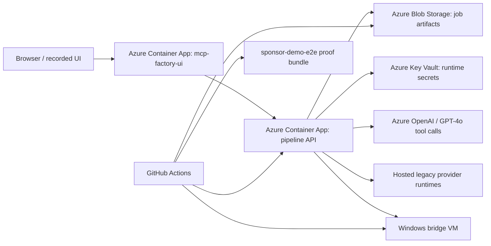
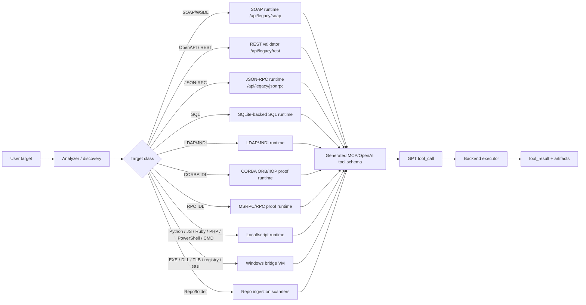

# Final Demo Brief

This is the shortest sponsor/teammate handoff page for the capstone final
demo.

If you only read one file, read this one.

## Start Here

- Deployed UI: [mcp-factory-ui](https://mcp-factory-ui.icycoast-8ddfa278.eastus.azurecontainerapps.io)
- Canonical sponsor proof run: [24613173130](https://github.com/evanking12/mcp-factory/actions/runs/24613173130)
- Latest deployed UI readiness check: [24673053993](https://github.com/evanking12/mcp-factory/actions/runs/24673053993)
- Proof index: [proof-index.md](proof-index.md)
- Video script: [video-demo-walkthrough.md](video-demo-walkthrough.md)
- Caveats: [caveats.md](caveats.md)

## What To Show

Use one live target in the UI:

- `tests/fixtures/sponsor/contoso_service.wsdl`

Recommended video path:

1. Load the SOAP/WSDL showcase in the deployed UI.
2. Analyze and show discovered invocables.
3. Select `GetCustomer` or `SubmitTicket`.
4. Generate the MCP schema.
5. Ask GPT to call the generated tool.
6. Show the `Live Proof Trace` panel:
   - `tool_call`
   - backend route
   - runtime mode
   - `tool_result`
7. Show downloads through `/api/download/{job_id}/{filename}`.
8. Show the canonical GitHub Actions proof bundle.

## Why This Is Trustworthy

This is not just a manual demo.

- The UI is the human walkthrough.
- The canonical GitHub Actions run is the proof contract.
- If discovery, schema generation, GPT `tool_call`, backend `tool_result`, or
  required artifacts are missing, the sponsor proof fails.
- The latest deployed UI readiness workflow confirms the public UI and backend
  are still in a good demo state.

Short sponsor sentence:

```text
The UI shows one complete end-to-end MCP conversion, and GitHub Actions proves that the same evidence contract is exercised across the broader sponsor-required target matrix.
```

## What Is Finished

The project is complete because it demonstrates:

- target input by upload or installed path/directory
- optional user hints
- invocable discovery
- user selection of invocables
- generated MCP/OpenAI tool schema
- GPT tool calling through chat
- backend tool execution and returned results
- downloadable artifacts
- Azure-hosted infrastructure
- GitHub Actions verification artifacts

The canonical proof run reports:

- `13/13` live execution format proofs for the non-VM sponsor matrix
- Windows bridge discovery and Windows GPT proof coverage
- repo-ingestion proof
- runtime-backed legacy protocol proofs

## What The Project Actually Proves

The project proves controlled, artifact-backed, GPT-tool-call-verified support
for:

- JSON-RPC
- SOAP/WSDL
- SQL
- OpenAPI/REST
- LDAP/JNDI
- CORBA ORB/IIOP proof path
- RPC/MSRPC proof path
- Windows binary/metadata discovery and bridge-backed proof
- repo/folder ingestion
- local/script runtimes such as Python, JavaScript, Ruby, PHP, PowerShell, and
  CMD/BAT

## Truthful Boundaries

The final claim is strong, but it is not unlimited.

This project does **not** claim:

- arbitrary enterprise CORBA estate migration
- arbitrary enterprise MSRPC estate migration
- arbitrary enterprise DCOM estate migration
- perfect arbitrary closed-source binary semantic recovery

This project **does** claim controlled runtime-backed or controlled
artifact-backed proofs for the sponsor-required surfaces.

## Azure Infrastructure



Use this when someone asks: "Where are the Microsoft services?"

Answer:

```text
The UI and API run in Azure Container Apps, artifacts live in Azure Blob Storage, secrets are managed in Key Vault, GPT tool calls run through Azure OpenAI, Windows-specific proofs use the bridge VM, and GitHub Actions is the verification layer that publishes the sponsor proof bundle.
```

## Target Routing



Use this when someone asks: "How do different binaries or contracts get
handled?"

## Best Demo Message

```text
We do not show every target live in the video. We show one complete SOAP/WSDL path in the UI, then use the GitHub Actions proof bundle to show that the same discovery, selection, schema generation, GPT tool-call, backend tool-result, and artifact contract is verified across the broader target matrix.
```

## If You Need More Detail

- [video-demo-walkthrough.md](video-demo-walkthrough.md) has the detailed script,
  prompts, requirement mapping, critique response, and narration.
- [proof-index.md](proof-index.md) maps the canonical run to exact artifact
  paths and focused workflows.
