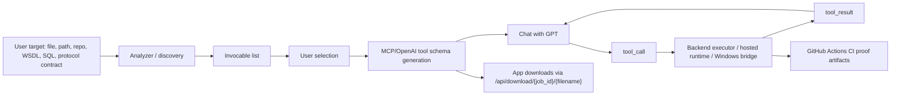

# Sponsor Video Demo Walkthrough

This is the recommended recorded demo path for the capstone presentation. Use
SOAP/WSDL as the live UI target because it is technically rich enough to show
legacy contract discovery, generated MCP tooling, GPT tool selection, runtime
execution, and downloadable artifacts without depending on fragile Windows
infrastructure during the video.

## Demo URL

- Web UI: <https://mcp-factory-ui.icycoast-8ddfa278.eastus.azurecontainerapps.io>
- Canonical proof run: <https://github.com/evanking12/mcp-factory/actions/runs/24613173130>
- Hardening integrity proof: <https://github.com/evanking12/mcp-factory/actions/runs/24613434034>
- Demo readiness proof: <https://github.com/evanking12/mcp-factory/actions/runs/24613487718>
- Focused Remote DCOM source proof: <https://github.com/evanking12/mcp-factory/actions/runs/24577926238>
- Artifact name: `sponsor-demo-e2e`

## Target To Use

Primary target:

- `tests/fixtures/sponsor/contoso_service.wsdl`

Fastest video path:

1. Open the deployed UI.
2. Click `Load SOAP/WSDL Showcase`.
3. Click `Analyze Binary`.

Manual upload path:

1. Open the deployed UI.
2. Upload `tests/fixtures/sponsor/contoso_service.wsdl`.
3. Use this hint:

```text
Video demo target: SOAP WSDL legacy customer service. Show discovery, generated MCP schema, GPT tool_call, and backend tool_result.
```

4. Click `Analyze Binary`.

## UI Walkthrough

1. Upload or load the SOAP/WSDL showcase.
2. Analyze the target and show that the UI discovers SOAP operations as invocables.
3. Select one or two operations. `GetCustomer` and `SubmitTicket` are the clearest.
4. Generate the MCP schema.
5. Show the generated schema preview and the download button.
6. Open the chat panel.
7. Ask GPT to call the generated tool with a deterministic sentinel.
8. Show the visible `tool_call` and `tool_result` transcript.
9. Download the generated schema or MCP artifacts through `/api/download/{job_id}/{filename}`.
10. Show the `CI Proof Bundle` link and explain that GitHub Actions artifacts are separate from app downloads.

## GPT Prompts

Use these prompts in the UI chat after generating the schema.

Prompt 1, direct proof:

```text
Call the generated SOAP customer lookup tool now. Use customerId CUST-001 and include this exact sentinel string in any available string argument: MCP_FACTORY_SOAP_VIDEO. Show me the tool_call and tool_result evidence.
```

Prompt 2, support-ticket proof:

```text
Create a Contoso support ticket for customer CUST-001. Subject: billing issue. Description: customer needs invoice help. Priority: high. Include sentinel MCP_FACTORY_SOAP_TICKET in any optional string argument, then summarize the tool_result.
```

Prompt 3, natural-language agent framing:

```text
A customer says: "I cannot find my invoice and need support." Use the available SOAP customer-service tool to create the right backend action. After the tool_result, explain what MCP Factory proved in one sentence.
```

Prompt 4, schema inspection:

```text
List the generated tools you can use from this SOAP/WSDL target, then call the safest customer lookup or ticket tool once.
```

## What To Say

Short claim:

```text
This project is complete because the UI demonstrates the user workflow, and the canonical GitHub Actions proof verifies the full requirement set: discovery, invocable selection, MCP schema generation, GPT tool calls, backend tool results, downloadable artifacts, Azure runtime infrastructure, Windows bridge evidence, repo ingestion, and hard legacy protocol proofs.
```

SOAP-specific framing:

```text
SOAP/WSDL is a good live target because the input is not source code for a chatbot. It is a legacy service contract. MCP Factory discovers operations from the WSDL, turns them into GPT-callable MCP tools, and routes the tool call to a controlled SOAP runtime that validates the envelope and returns a backend tool result.
```

Hard-legacy proof framing:

```text
The live video uses SOAP because it is stable and visually clear. The proof matrix then shows the broader runtime-backed evidence for JSON-RPC, SOAP, SQL, REST, LDAP/JNDI, CORBA ORB/IIOP, MSRPC, controlled Remote DCOM, Windows discovery, and repo ingestion.
```

Boundary:

```text
This capstone does not claim perfect arbitrary closed-source binary semantic recovery or arbitrary enterprise estate migration. The proof is controlled, runtime-backed, artifact-backed, and GPT-tool-call verified.
```

## Backend Diagram



## Teammate Commit Assessment

Commit `ab44a3457b5c8c805afa42183ae65fd26c971be7` in
`TheNgith/mcp-factory` is a useful error-output improvement, not merely a
formatting refactor. It adds the idea of structured failure diagnostics for tool
calls:

- `tool_result` events can include an `error` object.
- failures are classified as sentinel, HRESULT, Win32, timeout, bridge
  unreachable, unknown tool, schema mismatch, or exception.
- the UI can render a failure badge, human-readable suggestion, attempted
  probes, and known-good arguments.
- generated MCP servers can return richer human-plus-JSON error messages.
- a synthetic `explain_failure` tool lets the model ask for diagnostics instead
  of retrying blindly.

Do not cherry-pick the commit directly into this repo. The local chat and
executor contracts are currently simpler: `api.chat.stream_chat` calls
`api.executor._execute_tool` and expects a plain string result, while that
commit expects traced execution hooks such as `_execute_tool_traced` and a
larger generated-server error-enrichment surface. A direct port would be
merge-risky.

Clean incorporation path:

1. Add `api/error_enrichment.py` as a pure classifier module.
2. Add a backward-compatible `_execute_tool_traced(inv, args)` wrapper that
   returns `{result_str, trace, error}` while keeping `_execute_tool(inv, args)`
   as the plain-string API.
3. Update `api/chat.py` so every `tool_result` SSE event includes
   `error: null` on success or a structured error payload on failure.
4. Update `ui/main.py` to render `evt.error` in a compact diagnostic block.
5. Add tests for success `error: null`, unknown-tool errors, timeout errors,
   bridge errors, and generated-server error payloads.
6. Vendor the enrichment module into generated MCP server artifacts only after
   the internal chat path is stable.

Recommendation: extract the principles and implement them as a small
`structured-tool-errors` tranche. That gives the professor-facing output
improvement without destabilizing the already-green sponsor proof contract.
